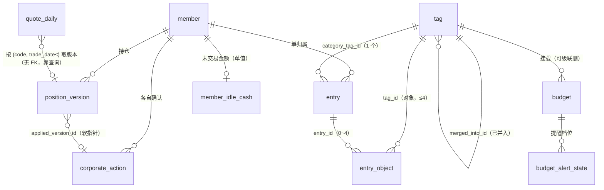

# D1 Schema 设计说明

> 本文件是**设计说明**，不是实现约定（实现约定在 `docs/specs/quote-parsing-contract.md`），
> 也不是词汇表（词汇在仓库根 `CONTEXT.md`）。
>
> **唯一真相是 `migrations/0001_init.sql` 本身**。本文件只回答「为什么长这样」，
> 凡与 DDL 冲突之处，以 DDL 为准并须回头修本文件。
>
> 决策依据：决策票 <https://github.com/Silencehuliang/FamilyAssetManagement/issues/14>（D1 schema 与索引定稿），
> 其上游 #2 #3 #4 #5 #6 #7 #8 #13 全部已关闭。
> 可复跑验证：`docs/verification/d1-schema-probe.py` / `.out.txt`
> （本机 Python 3.13.12 / SQLite **3.53.1**，**不是 D1 的版本**）。

---

## 1. 一句话总纲

**12 张表、10 个显式索引（8 个有 SELECT 消费者 + 2 个唯一索引由写入闸消费）、16 个触发器；
不落任何派生汇总表、不落任何快照表。**
所有收益、汇报、预算消耗一律**实时算**；落库的只有**事实**（记账、持仓版本、行情、除权事件）
与**不可重算的事件记录**（推送、提醒状态、心跳、除权确认状态）。

---

## 2. 表清单

| 表 | 角色 | 落库理由 |
|---|---|---|
| `member` | 主体 | 成员即登录身份，恰 2 位 |
| `tag` | 标签 | 混合式：两级类别树 + 平铺对象标签，同一实体 |
| `entry` | 事实 | 支出记录（单归属、1 类别、金额、发生时间） |
| `entry_object` | 关联 | 一笔 0~4 个对象标签 |
| `budget` | 版本化配置 | 一个生效版本一行；预算数值不可由 id 重建 |
| `budget_alert_state` | 事件 | 「某版本 × 某周期 × 某档位已提醒」——无法从明细重算 |
| `report_delivery` | 事件 | 推送不可逆，必须幂等 |
| `cron_run` | 事件 | 心跳：静默失败只有它能发现 |
| `position_version` | 版本化事实 | 持仓按生效日版本化；数量与成本价不可重建 |
| `member_idle_cash` | 当前值 | 成员级单值、不版本化、不进任何收益率分母 |
| `quote_daily` | 事实 | 行情：**唯一副本**，历史昨收不可重建 |
| `corporate_action` | 事件 + 状态 | 除权事件与成员确认状态（「已忽略」也是必须记住的决定） |

**刻意不存在的表**（每条都有上游票的明确否决）：

- 报告 / 汇报快照表、任何收益汇总表、任何行情缓存表 —— #4 + #6 + #7 + #8 + #13 **五处同向**
- `position_snapshot`（每日持仓快照）—— #7 明确否决
- 交易日历表 —— #8 / #13 明确否决（交易日序列由行情源返回的日期序列定义）
- 鉴权 / 会话表 —— **尚未定盘**，见 §9

---

## 3. ER 图



说明：

- `position_version` 与 `quote_daily` **之间没有外键** —— 行情是客观事实，不因持仓而存在；
  两者的结合发生在查询里（`position_version.effective_date <= quote_daily.trade_date` 取最新版本）。
- `corporate_action.applied_version_id` 是**软指针**（无 `REFERENCES`），理由见 §4 裁决 G。
- `quote_daily` **不带 `member_id`** —— 行情全家庭共享（#8 R4）。

---

## 4. 关键设计裁决（含被否选项）

### 4.1 金额与价格的存储类型

**裁决：一律 `INTEGER`，绝不 `REAL`。**

| 量 | 单位 | 后缀 | 依据 |
|---|---|---|---|
| 支出金额、持仓成本价、行情价、预算上限、未交易金额 | 分 | `_cents` | #4「金额全程以整数分计算」/ #5 / #7「价格存分/股」 |
| 每股派息 | 微元 | `_micro` | #8：实测茅台每股 `28.02423` 元有 **5 位小数**，分与厘都失真 |
| 股本送转比例 | 万分比 | `_ppm` | #8：`10送3 → 3000` 精确 |
| 预算预警阈值 | 万分比 | `_ppm` | 默认 `800000` = 80% |

被否：`REAL` 存元（浮点误差会在求和中累积，且与「分」口径的展示层要来回换算）；
`TEXT` 存金额（无法用 SQL 求和）。

配套写入闸：元 → 分**必须 `round()` 不得截断** —— #13 实测 7 个样例里 3 个
`int()` 与 `round()` 结果不同（`0.290 → 28.999999999999996`，int 得 28，应为 29）。
这条属实现契约（`quote-parsing-contract.md` §6.1），schema 侧只能保证列是整数。

### 4.2 外键强制：D1 默认开着，且关不掉

**一手依据**（Cloudflare 官方 D1 文档，检索口径 2026-09-15，
<https://developers.cloudflare.com/d1/sql-api/foreign-keys/>），原文：

> *"By default, D1 enforces that foreign key constraints are valid within all queries and migrations.
> This is identical to the behaviour you would observe when setting `PRAGMA foreign_keys = on`
> in SQLite for every transaction."*

> *"Because D1 runs every query inside an implicit transaction, user queries cannot change this
> during a query or migration. Instead, D1 allows you to call `PRAGMA defer_foreign_keys = on` or
> `off`, which allows you to violate foreign key constraints temporarily (until the end of the
> current transaction)."*

结论三条：

1. **D1 恒为 `foreign_keys = ON`，无需也不能在 schema 里打开。** 本 DDL 按依赖顺序建表，
   从不依赖「建表期间暂时违反外键」。
2. 需要「暂时违反」时（结构性迁移），唯一入口是 **`PRAGMA defer_foreign_keys = ON`**，
   见 §8。
3. 一处**如实标注的文档张力**：D1 的 SQL statements 页把 `PRAGMA foreign_keys = (on|off)`
   列为「compatible」，而 foreign keys 页说用户查询无法在事务内改变它。本设计**不依赖**
   关闭外键，故该张力不影响我们。

⚠️ **二手来源（未获官方一手确认）**：有第三方文章称 wrangler 本地 D1 模拟器在 2026-04
之前默认**关闭**外键、与远端不一致（`workers-sdk#5092`）。本机验不了。**若本地开发依赖
外键拦截，须自行验证**。

### 4.3 层级与类型：CHECK 管不了跨行，故用触发器

`CHECK` 不能含子查询，所以下列规则只能由触发器承担（共 16 个，全部实测过拒绝行为）：

| 规则 | 为何 CHECK 做不了 |
|---|---|
| 类别标签至多两级（父必须是根类别） | 需要读父行 |
| 有子节点者不得再获得父（否则变相三级） | 需要读子行 |
| 对象标签不得有父 | 需要读 type —— 实际可 CHECK，但为集中一处仍用触发器 |
| `entry.category_tag_id` 必须指向 `kind='category'` | 外键只保证「存在」，不保证「类型对」 |
| `entry_object.tag_id` 必须指向 `kind='object'` | 同上 |
| 一笔 Entry 至多 4 个对象标签 | 需要 `COUNT(*)` |
| 预算只能挂类别标签 | 需要读 tag.kind |
| 成员数恰 2、成员不可删 | 需要 `COUNT(*)` |
| 默认标签完全不可变 | `is_builtin=1` 时的整行冻结 |
| `applied_version_id` 必须指向同（成员, 代码）且生效日 = 除权日的版本 | 需要联查 |

已用触发器实现、且由 `AFTER DELETE` 触发器**把 #13 R12 的三步撤销塌缩成一步**：
删掉那条持仓版本 → `corporate_action` 自动回置 `pending`、清空 `decided_at` 与
`applied_version_id`。不做这一步的话，`CHECK ((status='applied') = (applied_version_id IS NOT NULL))`
会在删版本后立刻被违反。

### 4.4 逐条裁决表

| # | 裁决 | 被否选项及理由 |
|---|---|---|
| A | 金额列一律带单位后缀（`_cents` / `_micro` / `_ppm`） | 沿用上游骨架名（`close` / `amount`）：物理列名不带单位时，「分 vs 元」在 SQL 里会被误读，而本项目已因「跨口径混算」出过事故 |
| B | **不设 `tag.path` 列** | #3 曾建议路径枚举。#4 实测 `path LIKE` 前缀匹配在默认配置 + 普通索引下**全表扫描**（须 `COLLATE NOCASE` 才命中），并明示「`path` 仅作展示/排错的冗余字段，**不参与查询**」。两级结构用 `parent_id` 自连接已够；维护 `path` 还要在改名/移动时同步 ⇒ 纯负担 |
| C | `entry` 增技术列 `created_at` | 无对应决策票。写入路径必然需要录入时刻；它不是「何时」——「何时」恒指 `occurred_at`（`CONTEXT.md`） |
| D | `entry.amount_cents > 0` | 无对应决策票。「只记支出」下 0 额记录无意义 |
| E | `position_version` 增代理主键 `id` + `UNIQUE(member_id, code, effective_date)`，取代复合主键 | 复合主键下 `applied_version_id` 无法落成单列外键。#7 R5 的「同 (成员,代码,生效日) 唯一」由 `UNIQUE` **完整保留**，实测取数计划与 #7 实测逐字一致（`SEARCH … USING INDEX sqlite_autoindex_position_version_1 (member_id=? AND code=? AND effective_date<?)`） |
| F | `corporate_action.kind` 扩为 `plan_category` 五值（新增 `dividend_bonus`） | 上游骨架 `kind ∈ {dividend, bonus, rights}` 是**单值**，而 #13 R11 要求「同时表达送转与现金分红两种成分」——实测方案原文形如 `10送1.00派43.74元(含税,…)`，单值承载不了。并加两条 CHECK 把 `plan_category` 与两个数值列绑死自洽 |
| G | `applied_version_id` 为**软指针**（无 `REFERENCES`） | 硬外键会挡下 #13 R12 撤销流程的第一步（删版本）；改由 `AFTER DELETE` 触发器代劳。代价：指针一致性落在应用 + 触发器上，不落在外键上 —— 这是本票唯一一处主动放弃引用完整性（见 §10） |
| H | `report_delivery.channel` 与 `cron_run.task` **不做 CHECK 枚举** | 通道选型仍在雾区（第三方推送渠道未定）、`task` 命名与 #12 的 cron 分派实现绑定。过早锁死＝凭空制造一次迁移。建议集见 §7 |
| I | 时间戳一律 UTC 秒；唯一例外 `cron_run.scheduled_at` 为 **UTC 毫秒** | 沿用 #6 的决定（来源 `controller.scheduledTime` 即毫秒）。同表混单位是已知隐患，见 §7 |
| J | `budget_alert_state` 主键顺序 = `(period_key, budget_id, tier)` | 上游未定顺序。实测以 `budget_id` 打头会使「取当期全部提醒状态」（唯一读路径）**全表扫描**；改序后为 `SEARCH … (period_key=?)` |
| K | **不建 `tag(merged_into_id)` 索引** | 无消费者：合并映射是「拿 `tag.id` 查目标」，走 rowid 直查；`tag` 是数十行维度表，为它建索引只增加写入成本（D1 按行计费，建索引的列每行多算 1 行写入） |
| L | 保留 `ix_entry_member_date`，并**补一条真实消费查询**（记账流水页） | 该索引在 19 个分析视图里一度**无消费者**。要么删、要么给出消费者；本票选了后者并留下实测证据（V20） |
| M | 新增 `ix_ca_code_date`（上游未要求） | #13 R1 的回填白名单校验按 `(code, ex_date)` 查、不带 `member_id`，而 `corporate_action` 主键以 `member_id` 打头 ⇒ 该查询会全表扫描。不新增索引则违反「事实表不得全扫」 |
| N | 两条**部分唯一索引**替代单条 `UNIQUE(tag_id, period_type, effective_from)` | `tag_id` 对家庭总预算为 NULL，而 **SQLite 的唯一约束对 NULL 完全无效**（#13 已实测）。单条唯一索引挡不住家庭总预算的重复版本 |

---

## 5. 索引与查询验收

### 5.1 每个分析视图的 SQL 条数

实测（`d1-schema-probe.py` §四）：**20 个视图全部 ≤ 5 条**，最重的是
「预算提醒巡检」3 条（读状态 / 取累计 / 写回，一次覆盖全部预算）与
「预算面板」2 条（含家庭总预算）。对照 D1 免费版每次调用 **50 次查询**的上限，余量 ≥ 10 倍。

### 5.2 `EXPLAIN QUERY PLAN` 判定

**判据（本票对 #4 验收标准的一处收窄，可复议）**：
#4 原文为「核心分析查询 `EXPLAIN QUERY PLAN` **不得出现 `SCAN`**」。实测中 `tag`
（数十行的维度表）在若干查询里被全扫，而那是**最优计划** —— 为它强加驱动顺序的代价
大于收益。故本票把判据限定在**事实表**上：

> **事实表（`entry` / `entry_object` / `quote_daily` / `position_version` / `budget` /
> `budget_alert_state` / `report_delivery` / `cron_run` / `corporate_action`）
> 不得出现 `SCAN`；维度表与物化子查询的 `SCAN` 一律如实列出。**

实测结果：**事实表 `SCAN` = 0 处**；维度表 `SCAN t`（= `tag`）出现 1 处（V7 预算面板的
外层驱动），已在输出中原样列出。

### 5.3 索引用途核对（每个索引都要有消费者）

| 索引 | 消费者 |
|---|---|
| `ix_entry_biz_date` | V1 类别轴、V3 对象轴、V5 时间趋势、V6 日均/环比、V7 预算面板、V8 提醒巡检 |
| `ix_entry_cat_date` | V2 类别轴下钻（`category_tag_id=? AND biz_date>? AND biz_date<?`） |
| `ix_entry_member_date` | V20 记账流水（按成员 + 区间倒序分页） |
| `ix_entry_object_tag` | V4 对象筛选 × 类别分组 |
| `ix_tag_parent` | V2 下钻（`parent_id=?`） |
| `ix_ca_code_date` | V15 回填白名单校验（按代码 + 除权日） |
| `ix_budget_period` | V7 预算面板、V8 提醒巡检（`period_type=? AND effective_from<?`） |
| `ix_cron_run_task` | V17 心跳「上次成功运行」 |
| `ux_budget_tag_version` / `ux_budget_household_version` | **写入闸**（重复版本被拒），不是 SELECT 计划 |

**删掉的**：`ix_tag_merged_into`（无消费者，见裁决 K）。
**不建的**：`quote_daily` 的日期维度二级索引（#8 R5：全部已知查询走主键前缀）；
`position_version` 的额外索引（#7：取数走唯一索引）。

### 5.4 行宽估算（#8 的估算 vs 本票实测）

实测 `quote_daily` 单行**净列宽 = 46 字节**（20 只 × 244 交易日 ≈ 0.214 MB/年），
与 #8 的估算「≈63 B/行、20 只 ≈0.31 MB/年」**同一量级**。

⚠️ 这只是**净列宽**，不含页填充与 B 树开销。本机 Python 未启用 `dbstat`，
**给不出页级实测** —— 如实标注，不以估算冒充实测。#8 已声明其数字为估算，
本条不改变该性质，只是把口径说清楚。

---

## 6. 约束清单的实测覆盖

`d1-schema-probe.py` §三 共 **60 条断言，60 条通过**，覆盖：

- 主体：成员上限、不可删
- 标签：两级硬限（含「有子节点者不得再获得父」）、默认标签完全不可变、
  「删除仅限零历史引用」（由外键 `RESTRICT` 承担）
- 记账：类别位类型、金额正负、**`biz_date` 必须等于 `occurred_at` 的东八区日期**
  （含东八区 00:30 的跨 UTC 日边角）、外键、对象上限 4、对象位类型
- 预算：版本唯一（含 NULL 陷阱）、`scope` 与 `tag_id` 的互斥、挂类别标签
- 行情：**假 0 防护**（`close_cents > 0`）、**`prev_close_cents > 0`**、
  feed 行必须带昨收 / manual 行可留空、代码规范化、主键幂等、
  **来源 rank 仅升级时覆盖**（`manual → backfill` 升级成功，反向被 WHERE 挡下）
- 除权：两种成分的自洽、状态与指针双向联动、跨股/跨日指针被拒、
  **撤销一步到位**、`(成员,代码,除权日)` 幂等、两位成员各自确认
- 持仓：代码格式、数量非负、版本唯一、0 股清仓版本
- 汇报与心跳：推送幂等（`INSERT OR IGNORE` 影响 0 行）、无日报、心跳三态、
  同一 `scheduled_at` 下「行情 / 除权」两行各记各的成败

---

## 7. 单位、时间与枚举约定

### 7.1 时间戳

| 列 | 单位 | 说明 |
|---|---|---|
| 除 `scheduled_at` 外全部时间列 | **UTC 整数秒** | #6 R4 |
| `cron_run.scheduled_at` | **UTC 整数毫秒** | 来源 `controller.scheduledTime` 即毫秒（#6） |
| `entry.occurred_at` | UTC 整数秒 | 与冗余列 `biz_date` 由 CHECK 绑死 |
| `*_date` / `effective_from` / `period_key` | **TEXT，中国标准时间口径** | `YYYY-MM-DD` / `YYYY-Www` / `YYYY-MM` / `YYYY` |

⚠️ **已知隐患（如实标注）**：`cron_run` 同表混用了秒与毫秒。这不是本票的主张，
而是 #6 已定名的列。**实现读取该表时不得假设「所有时间列同单位」**；
若要统一，须回 #6 复议（改名 + 迁移）。

**SQL 纪律**：本 schema 不出现 `datetime()` / `localtime()`。周期边界一律由应用层按
Asia/Shanghai 算成 UTC 整数区间后再传 SQL（#6 R4：D1 运行时本地时区即 UTC，
`localtime` 是空操作；本机却是东八区 ⇒ 同一条 SQL 两处含义不同）。

**唯一一处 `date()` 的用法**是 `entry.biz_date` 的 CHECK，参数固定为
`'unixepoch','+8 hours'`，与运行环境时区无关 —— 本机已实测，D1 侧列入门禁（§9）。

### 7.2 建议枚举（暂不约束）

`report_delivery.channel`：建议 `'inapp'`（站内，权威）、第三方通道名（尽力而为、不重试）。

`cron_run.task`：建议 `'quote_fetch'` / `'corporate_action'` / `'budget_alert'` /
`'report_weekly'` / `'report_monthly'`。行情与除权**各占一行**（#13 R9）。

`cron_run.status`：`'ok'` / `'skipped'` / `'failed'` —— 这一列**已用 CHECK 约束**
（#13 要求心跳能容纳三态；`skipped` 专指「源给出了明确的日期否定 ⇒ 非交易日」）。

---

## 8. 迁移策略

### 8.1 文件与命令

```
migrations/
├── 0001_init.sql          ← 本票交付
└── NNNN_<snake_case>.sql  ← 后续
```

- 命名：**4 位零填充序号 + 下划线 + 短名**，序号单调递增。
- 创建：`wrangler d1 migrations create <DB> <name>`
- 本地：`wrangler d1 migrations apply <DB> --local`
- 远端：`wrangler d1 migrations apply <DB> --remote`
- **已应用的迁移文件永不修改** —— 改了也不会重跑。要修就新开一个迁移。

⚠️ 「D1 用自己的表记录已应用迁移、重复 apply 会被跳过」这一条来自**二手来源**，
本票未核实（官方 Migrations 页未在本次检索中逐字核对）。**上线前的第一次 apply
必须人工确认行为**，别基于假设。

### 8.2 可逆与不可逆

| 变更类型 | 做法 |
|---|---|
| 加列（可空或带默认值） | `ALTER TABLE … ADD COLUMN`，安全 |
| 加表 / 加索引 / 加触发器 | 直接新增，安全 |
| 删列 / 改列类型 / 改约束 / 改主键 | SQLite 能力有限（`DROP COLUMN` 需 3.35+，D1 版本未核实）⇒ **走 12 步表重建** |
| 数据回填 | 单独一个迁移文件，与结构变更**分开**，便于失败时定位 |

**表重建在 D1 上的关键约束**：D1 每个查询都在隐式事务里且 **`PRAGMA foreign_keys = OFF` 会被静默忽略**
（§4.2 一手依据）。故重建期间必须：

```sql
PRAGMA defer_foreign_keys = ON;   -- 迁移文件顶部；延迟到事务结束才校验
-- 建新表 → INSERT ... SELECT → DROP 旧表 → ALTER TABLE 新表 RENAME TO 旧名
-- 事务结束时若仍有未解决的外键违反，D1 抛 FOREIGN KEY constraint failed
```

⚠️ `PRAGMA defer_foreign_keys = ON` **不阻止 `ON DELETE CASCADE` 执行**（官方原文明确），
所以带级联的表重建要额外小心。

### 8.3 不可逆变更的前置动作

**任何不可逆迁移之前，先导出**：`wrangler d1 export <DB> --remote --output <file>`
（⚠️ 该命令来自官方 CLI 文档，**本票未实跑核实**）。

- **v1 阶段**（全新开始、无生产数据）：破坏性迁移可接受。
- **上线之后**：schema 变更一律**只加不删**；确需删除时先导出 + 保留一个冻结周期的
  双写窗口。这条与 #15 «备份与导出策略» 直接相交 —— **已由 #15 落定**：采用
  D1 Time Travel（Free 回溯 7 天）+ 手动导出 + 「迁移前先导出」runbook 的三层备份，
  **不做自动备份、不新增 cron**（见 `docs/specs/backup-export-contract.md` §3）。

---

## 9. 未决缝（明确不闭合的部分）

| 缝 | 归属票 | 本 schema 的处置 |
|---|---|---|
| 成员凭据 / 会话 / 登录态 | **#9 鉴权与访问控制方案（未关闭）** | `member` 表**不含**任何凭据列。预期由 `0002_auth.sql` 以 `member.id` 为锚补上；本票**不预判其形状**（哈希算法、会话存储位置、令牌表都要等 #9 定） |
| `task` 命名与 cron 分派 | #12 部署拓扑定稿（未关闭） | `cron_run.task` 不做 CHECK 枚举（裁决 H） |
| 第三方推送通道 | 雾区 | `report_delivery.channel` 不做 CHECK 枚举 |
| 默认标签集与模板包内容 | 雾区（随 #11 落定） | 本 schema 不预置任何标签数据 —— 默认集是**种子数据**，不是 schema |

**D1 侧待复核四项**（本机 SQLite 3.53.1 ≠ D1）：

1. `SELECT sqlite_version()`
2. `CHECK (biz_date = date(occurred_at,'unixepoch','+8 hours'))` 能否被 D1 接受并正确求值
   （本机通过；不接受则去掉该 CHECK，改由写入闸保证，其余 schema 不动）
3. `PRAGMA foreign_keys` 的实际默认值（官方说恒 ON，已实测对齐）
4. `batch()` + `ON CONFLICT … DO UPDATE … WHERE` 的组合行为

---

## 10. 已知局限（如实列出）

1. **一处主动放弃的引用完整性**：`corporate_action.applied_version_id` 是软指针，
   数据库不保证它一定指向存在的行。代价换的是「撤销 = 删版本」这一步不被外键挡下
   （裁决 G）。缓解：配套 `AFTER DELETE` 触发器 + `CHECK ((status='applied') = (applied_version_id IS NOT NULL))`。
2. **`cron_run` 同表混用秒与毫秒**（§7.1）—— 这是上游决定的直接后果，不是本票的主张。
3. **触发器承担了 11 条跨行规则**，其执行顺序在 SQLite 中**未被文档化保证**。
   本票的实测显示给出的拒绝行为稳定，但若日后出现「两个触发器都可能拒绝同一语句」
   的场景，报错信息可能不稳定（不影响正确性，只影响排查体验）。
4. **「一笔至多 4 个对象」靠 `COUNT(*)` 触发器**，在 D1 的单线程写模型下成立；
   若日后 D1 引入并发写同一 Entry，需改为约束级方案。
5. **行宽只是净列宽估算**（§5.4），不是页级实测。
6. **迁移的幂等行为、`d1 export`、本地模拟器外键默认值** 三项均来自二手来源或未核实
   （§8.1 / §8.3 / §4.2），已逐条标注。
7. **本 schema 覆盖的是「已关闭的票所决定的一切」**；#9 / #12 关闭后必然需要新迁移，
   这是设计预期，不是缺陷。
8. **【2026-09-16 更正】索引计数勘误。** 本节原本与 §1 总纲写作「11 个显式索引」，
   经决策票 #9 在建立基线比对时核对，**正确值是 10 个**：
   `migrations/0001_init.sql` 中共 10 条 `CREATE INDEX` 语句（8 个 `ix_*` + 2 个 `ux_*`），
   与 `d1-schema-probe.out.txt` §【一】的机器盘点（显式 10 / 隐式 8）一致。
   同时更正 #14 决议中「9 个显式索引全部命中」的说法 —— 实际是 **8 个有 SELECT 消费者**
   （§5.3 的表格本身是正确的，10 个索引逐行列全，只是总数陈述算错了）。
   §5.3 / §5.2 的逐条结论不受此勘误影响。

---

## 11. 给下游票的派生要求

**→ «备份与导出策略»（#15 —— 已收口）**

> ⚠️ **本节 5 条派生要求已由 #15 全部落定**，结论见 `docs/specs/backup-export-contract.md`
> （第六份实现契约）。其中第 5 条的答复是**「不需要加列、不需要加表」**（该契约 §9）。
> 本节保留原文供追溯，**不再代表未决事项**。

1. **备份必须是「表级完整」而非「数据子集」**：本 schema 里
   `quote_daily`、`corporate_action`、`position_version`、`budget`、`budget_alert_state`、
   `report_delivery`、`cron_run` **全部**属于「不可由其他表重算」的一类。
   `quote_daily` 尤其 —— 历史昨收不可重建（#13 §14.1），**它不是可重抓的缓存而是唯一副本**。
2. **导出格式必须能表达 NULL 与整数**：`prev_close_cents` 允许为 NULL（回填白名单
   校验不过即置 NULL），CSV 需明确 NULL 的写法；金额是整数分，**不得在导出时转成元**。
3. **必须导出「结构 + 数据」两份**：结构可从 `migrations/` 重建，但触发器与索引的
   重建同样依赖迁移文件的完整性 ⇒ 备份清单里应包含 `migrations/` 目录。
4. **回导必须按依赖顺序**（`member` → `tag` → `entry` → …），且因 D1 恒开外键，
   回导时的 `PRAGMA defer_foreign_keys = ON` 是必需品而非可选项（§4.2）。
5. 本票未给 schema 版本号列。**若 #15 需要「备份里标注 schema 版本」，请回本票复议**
   —— 那会给所有表加一列或引入一张 `schema_meta` 表，属结构变更。
   ✅ **已由 #15 答复：不需要**（`backup-export-contract.md` §9）。schema 版本改用 D1 自带的
   `d1_migrations` 表 + `migrations/` 目录表达 ⇒ **零 schema 变更，本票无须复议**。

**→ «前端信息架构与页面清单»（#11）**

6. 「上次成功运行」取自 `cron_run`（`ix_cron_run_task`，V17）。**注意该表
   `scheduled_at` 是毫秒、其余时间列是秒**（§7.1）—— 前端格式化时不要一把梭。
7. 记账流水页的成本是**索引化的**（V20 走 `ix_entry_member_date`）；若 #11 要加
   「按标签筛选 + 分页」的组合筛选，请带回来，本票只验证了已列出的 20 个视图。
